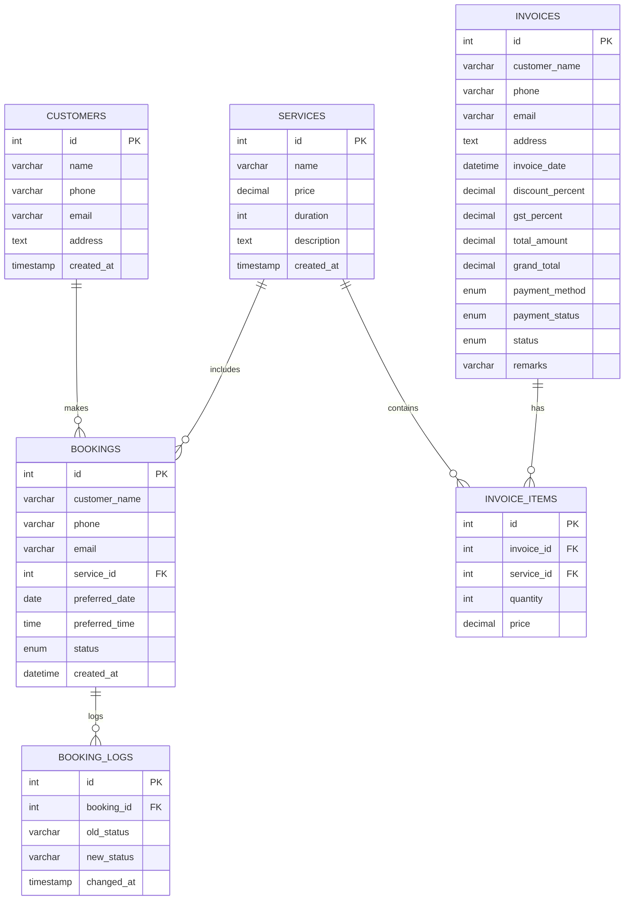

# 💆 Spa Billing System

A comprehensive, modern billing and management system designed specifically for spa businesses. This PHP-based web application streamlines operations including booking management, invoice generation, service tracking, and business analytics.


---

## 📋 Table of Contents

- [Features](#-features)
- [Tech Stack](#-tech-stack)
- [Project Structure](#-project-structure)
- [Database Schema](#-database-schema)
- [Installation](#-installation)
- [Usage](#-usage)
- [Screenshots](#-screenshots)
- [Contributing](#-contributing)
- [License](#-license)

---

## ✨ Features

### 🎯 Core Functionality

| Feature | Description |
|---------|-------------|
| **Admin Dashboard** | Real-time overview of customers, bookings, sessions, and revenue |
| **Service Management** | Add, edit, and manage spa services with pricing and duration |
| **Invoice System** | Create, edit, view, and print professional invoices |
| **Booking Management** | Accept, reject, and track customer appointment bookings |
| **Analytics** | Visual insights into service performance and revenue trends |
| **Customer Portal** | Easy-to-use booking form for customers |

### 💡 Key Highlights

- ✅ **Quick Invoice Creation** - Generate invoices in seconds
- ✅ **Multiple Payment Methods** - Support for Cash, Card, and UPI
- ✅ **Discount & GST Handling** - Automatic tax and discount calculations
- ✅ **Print-Ready Invoices** - Professional invoice templates
- ✅ **Booking Status Tracking** - Pending → Accepted → Completed workflow
- ✅ **Responsive Design** - Works seamlessly on desktop and mobile
- ✅ **Beautiful UI** - Modern, spa-themed aesthetic design

---

## 🛠 Tech Stack

| Technology | Purpose |
|------------|---------|
| **PHP 8.0+** | Backend server-side logic |
| **MySQL / MariaDB** | Database management |
| **Bootstrap 5.3** | Responsive UI framework |
| **Font Awesome 6** | Icons and visual elements |
| **JavaScript** | Interactive UI animations |
| **XAMPP/WAMP** | Local development server |

---

## 📁 Project Structure

```
spa_billing_system/
├── 📄 spa_billing_system.sql     # Database schema & sample data
├── 📄 db.txt                     # Database connection info
├── 📁 invoice/
│   └── 📁 pages (3)/
│       ├── 📁 config/
│       │   └── 📄 db.php              # Database connection
│       └── 📁 pages/
│           ├── 📄 index.php           # Home page
│           ├── 📄 dashboard.php       # Admin dashboard
│           ├── 📄 services.php        # Service management
│           ├── 📄 create_invoice.php  # Create new invoice
│           ├── 📄 edit_invoice.php    # Edit existing invoice
│           ├── 📄 view_invoice.php    # View invoice details
│           ├── 📄 print_invoice.php   # Print-friendly invoice
│           ├── 📄 invoices.php        # Invoice list
│           ├── 📄 quick_invoice.php   # Quick invoice creation
│           ├── 📄 save_invoice.php    # Save invoice handler
│           ├── 📄 update_invoice.php  # Update invoice handler
│           ├── 📄 booking_form.php    # Customer booking form
│           ├── 📄 manage_bookings.php # Admin booking management
│           ├── 📄 submit_booking.php  # Booking submission handler
│           ├── 📄 update_booking.php  # Booking update handler
│           ├── 📄 analytics.php       # Service analytics
│           ├── 📄 get_customer.php    # Customer data API
│           ├── 📄 navbar.php          # Navigation component
│           └── 🖼 logo.png            # Application logo
```

---

## 🗄 Database Schema

The system uses 6 interconnected tables:



### 📊 Pre-loaded Services

| Service | Price (₹) | Duration |
|---------|-----------|----------|
| Swedish Massage | 2,500 | 60 min |
| Deep Tissue Massage | 3,000 | 60 min |
| Aromatherapy Massage | 2,800 | 45 min |
| Hot Stone Therapy | 3,500 | 75 min |
| Facial Treatment | 2,000 | 45 min |
| Body Scrub | 1,800 | 30 min |
| Manicure | 1,200 | 30 min |
| Pedicure | 1,500 | 45 min |

---

## 🚀 Installation

### Prerequisites

- **PHP 8.0+** or higher
- **MySQL 5.7+** or **MariaDB 10.4+**
- **Web Server**: Apache (XAMPP/WAMP/LAMP) or Nginx
- **phpMyAdmin** (optional, for database management)

### Step-by-Step Setup

1. **Clone the Repository**
   ```bash
   git clone https://github.com/Kamesh-A13/Spa-Billing-System.git
   cd spa-billing-system
   ```

2. **Set Up the Database**
   - Open **phpMyAdmin** or your MySQL client
   - Create a new database named `spa_billing_system`
   - Import the SQL file:
     ```sql
     -- In phpMyAdmin, use the Import feature
     -- Or via command line:
     mysql -u root -p spa_billing_system < spa_billing_system.sql
     ```

3. **Configure Database Connection**
   
   Edit `invoice/pages (3)/config/db.php`:
   ```php
   <?php
   $host = "localhost";
   $user = "root";           // Your MySQL username
   $password = "";           // Your MySQL password
   $database = "spa_billing_system";

   $conn = new mysqli($host, $user, $password, $database);

   if ($conn->connect_error) {
       die("Connection failed: " . $conn->connect_error);
   }
   ?>
   ```

4. **Start Your Local Server**
   - **XAMPP**: Start Apache and MySQL services
   - **WAMP**: Start all services
   - **Manual**: `php -S localhost:8000` (if using PHP built-in server)

5. **Access the Application**
   ```
   http://localhost/spa_billing_system/invoice/pages (3)/pages/index.php
   ```

---

## 📖 Usage

### 🏠 Home Page
The main landing page provides quick access to all major features:
- Admin Dashboard
- Service Management
- Invoice Creation
- Booking Management
- Analytics

### 📊 Admin Dashboard
Monitor key metrics at a glance:
- Total Customers
- Total Bookings
- Completed Sessions
- Total Revenue

### 🛠 Managing Services
1. Navigate to **Manage Services**
2. Add new services with name, price, duration, and description
3. Edit or delete existing services

### 📝 Creating Invoices
1. Click **Create Invoice**
2. Enter customer details
3. Select services and quantities
4. Apply discounts and GST if applicable
5. Choose payment method
6. Save and print

### 📅 Booking Management
1. Customers submit bookings via the **Booking Form**
2. Admin views pending bookings in **Manage Bookings**
3. Accept or reject bookings
4. Mark completed bookings and generate invoices

---


## 🤝 Contributing

Contributions are welcome! Here's how you can help:

1. **Fork** the repository
2. **Create** a feature branch (`git checkout -b feature/AmazingFeature`)
3. **Commit** your changes (`git commit -m 'Add some AmazingFeature'`)
4. **Push** to the branch (`git push origin feature/AmazingFeature`)
5. **Open** a Pull Request

### Ideas for Contribution
- [ ] Add user authentication system
- [ ] Implement email notifications
- [ ] Add customer loyalty program
- [ ] Integrate payment gateway
- [ ] Add report export (PDF/Excel)
- [ ] Multi-language support

---

## 📄 License

This project is licensed under the **MIT License** - see the [LICENSE](LICENSE) file for details.

---


## 🙏 Acknowledgments

- [Bootstrap](https://getbootstrap.com/) for the amazing UI framework
- [Font Awesome](https://fontawesome.com/) for beautiful icons
- All contributors who help improve this project

---

<div align="center">

**⭐ Star this repository if you found it helpful!**

Made with ❤️ for spa businesses everywhere

</div>


